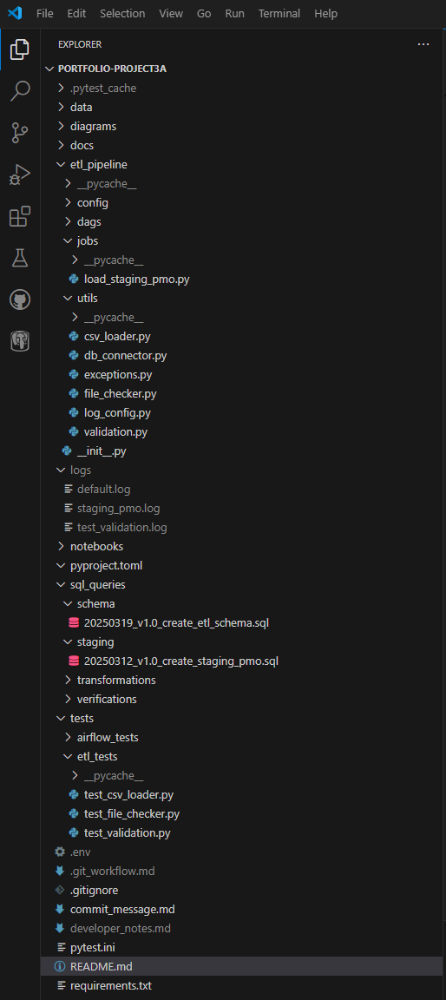

# Project 3A: Python-based ETL Workflow with PostgreSQL + Logging
This project demonstrates how to build a **modular, production-style ETL pipeline** using **Python, PostgreSQL, and SQLAlchemy**. It features:
- Automated data ingestion from CSV into a **PostgreSQL staging schema**
- Pre-load **data validation and file checks**
- Centralized **logging with Loguru** for pipeline observability
- Structured for **future Airflow orchestration and cloud expansion**

## Objective

Convert previously manual SQL workflows into a **modular, production-style Python ETL pipeline**, applying
Data Engineering best practices to prepare for automation with Apache Airflow.

## Overview

This project builds on the fully normalized PostgreSQL database from **Project 2A**, implementing a **Python-based batch ingestion pipeline** to extract, validate, and load transactional data (from the `pmo.csv` file) into the `etl.staging_pmo` table.

The primary focus is on buidling a **robust ETL workflow using Python**, including:
- **Centralized logging, validation, and exception handling**
- **Structured project organization** using modular utilities (`utils/`)
- **SQLAlchemy + Pandas integration** for database interaction
- **Git-based version control** with SemVer tagging

The project acts as a critical bridge between **manual SQL data processes** and **automated orchestration pipelines**
to follow in Project 3B.

## ETL Phases + Data Flow

This batch pipeline executes the following ETL phases:
- **Extract:** Read `pmo.csv` from the `data/raw/` folder using a fallback delimiter strategy.
- **Validate:** Apply pre-ingestion column validation and file integrity checks.
- **Load:** Write validated records into the `etl.staging.pmo` table in PostgreSQL.

***Note: Light transformations (e.g., cleaning NULLS, renaming columns) are deferred to Project 3B (via Airflow DAGS) and Project 3C (via SQL/dbt)***

## Data Description

This ETL pipeline processes the **raw transaction file `pmo.csv`**, which contains:
- Payment-level financial records (255,000+ rows)
- Columns related to payment metadata, campaign linkage, purchase requisitions, and currency amounts

The extracted data is validated and loaded into a canonical staging table: `etl.staging_pmo`.

## Key Steps + Technologies

### Step 1: Python Environment + Package Setup
- Isolated Python environment created using `venv` (lives **outside the Git repository** to avoid committing virtual environment files).
- All dependencies tracked in `requirements.txt` for easy reproducibility.
- Key dependencies: `pandas`, `sqlalchemy`, `psycopg2`, `python-dotenv`, `loguru`, `pytest`
- `.env` file used for PostgreSQL connection management

### Step 2: Modular Utility Design (`utils/`)
- `csv_loader.py` - Fallback delimiter loader with error handling
- `validation.py` - Column validation logic
- `file_checker.py` - File existence and extension checks
- `db_connector.py` - Centralized PostgreSQL connector (both psycopg2 and SQLAlchemy)
- `log_config.py` - Centralized logger setup using Loguru
- `exceptions.py` - Custome exception definitions

### Step 3: Staging Job Script
`jobs/load_staging_pmo.py` orchestrates the entire pipeline:
- Loads and validates `.env`
- Performs file checks and data extraction
- Validates column structure
- Loads cleaned data into `etl.staging_pmo`

### Step 4: Unit Testing with Pytest
- `test_csv_loader.py`, `test_validation.py`, and `test_file_checker.py`
- Log redirection integrated into `caplog`
- Tests simulate malformed delimiters, column mismatches, and invalid file types

### Step 5: Git Version Control + Logging
- **SemVer applied to all SQL scripts (`sql_queries/`)**
- Structured Git commits and tracked changes via `commit_message.md`
- Log files saved in `logs/` directory with rotation and compression

## Repository Structure

## Key Insights + Takeaways

- ✅ **Python ETL pipelines** allow for modular, reusable workflows
- ✅ **Centralized logging and exception handling** make debugging easier and promote observability
- ✅ **Pre-validation checks prevent ingestion failures** and preserve schema alignment
- ✅ **Test-driven development (TDD)** helps validate edge cases and malformed input data
- ✅ **Loading into the correct schema (`etl`) avoids accidental overwrite of canonical tables**
- ✅ **This project provides the foundation for Airflow-based orchestration** (Project 3B)

## Next Steps
This project concludes the **manual ETL automation phase** and prepares the pipeline for orchestration.

➡️ **Project 3B: Apache Airflow DAG Automation**
- Automate this workflow using **Apache Airflow DAGs**
- Add **lightweight transformations** (e.g., rename columns, coalesce NULLS)
- Integrate a **currency conversion API** and **mock JSON ingestion job**

➡️ **Project 3C: Data Warehousing + Cloug Integration**
- Push cleaned data to **Snowflake and AWS S3**
- Begin **dbt transformations**, CI/CD, and cloud-based analytics workflows

## Final Thoughts
Project 3A marks a significant milestone: transitioning from **static SQL workflows to Python-based batch ETL pipelines**.
Through structured utility modules, centralized logging, and staged ingestion, this project models **real-world data engineering pipelines**.

Looking ahead, the shift to **scheduling, orchestration, and cloud-scale automation** begins.
